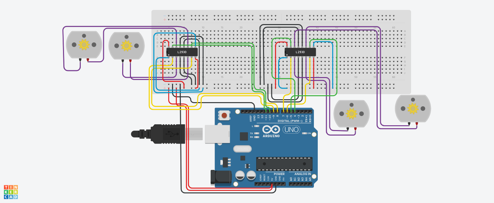

# Four DC Motors Control Using L293D

This project demonstrates how to control four DC motors using an Arduino Uno and two L293D motor driver ICs. The project was designed and simulated using Tinkercad.


This project was completed as one of the tasks in the **Electrical Engineering, Electronics, and Internet of Things Track** during the **Smart Methods Robotics Internship Program**.

---

## Components

- Arduino Uno
- 2 × L293D Motor Driver IC
- 4 × DC Motors
- Breadboard
- Jumper Wires
- USB Cable

---

## Arduino Pin Connections

### First L293D

| Input | Arduino Pin |
|-------|-------------|
| IN1 | D7 |
| IN2 | D6 |
| IN3 | D5 |
| IN4 | D4 |

### Second L293D

| Input | Arduino Pin |
|-------|-------------|
| IN1 | D9 |
| IN2 | D8 |
| IN3 | D10 |
| IN4 | D11 |

---

## Motion Sequence

- Move Forward for **1 minute**
- Move Backward for **30 seconds**
- Turn Right for **5 seconds**
- Turn Left for **5 seconds**
- Alternate between Right and Left for **1 minute**
- Stop

---

# Project Demonstration

## 1. Forward Movement (1 Minute)

https://github.com/user-attachments/assets/e7c3e52f-b16c-4dd1-a007-69a05a1f127b

---

## 2. Backward Movement (30 Seconds)

https://github.com/user-attachments/assets/1180519e-bd55-4375-a7fd-dab7bac037f6

---

## 3. Right & Left Movement

https://github.com/user-attachments/assets/db6b27d9-d950-4e33-9175-7897eb1eaecf

---

# Final Circuit Diagram

<p align="center">

</p>

---

## Notes

- Two L293D motor drivers are used to control four DC motors.
- ENA and ENB are connected directly to 5V because speed control is not required in this task.
- The circuit was simulated using Tinkercad.
- The motor direction depends on the wiring of Terminal 1 and Terminal 2.

---

## Project Files

```
4DC_Motors/
│
├── README.md
├── 4DC_Motors.ino
├── 4DC_Motors.png
├── 1Min_Forward_.mp4
├── 30sec_backward_.mp4
└── left_right.mp4
```

---

## Internship Task

This project was completed as one of the tasks in the **Electrical Engineering, Electronics, and Internet of Things Track** during the **Smart Methods Robotics Internship Program**.
